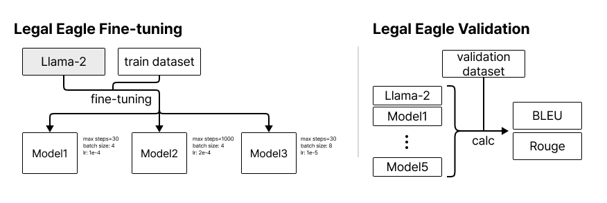

# Legal Eagle 🦅
### 사례에 대한 위법 여부 및 위법 사항 판별 모델 및 애플리케이션
> 법률 관련 데이터셋을 이용하여 Meta사의 Llama-2 모델에 대하여 법률 처리 분야에 대해 특화 될 수 있도록 Fine-tuning 진행하고, 해당 모델을 서버에 연결하여 서버, 애플리케이션 간 커뮤니케이션

## 👥 NLP Team Project - Team 7 👥 
- BoMin LEE, Jeonhui LEE, Chanwoo LIM, Hyeongbin SEO, Sebin JEONG

 
 
 

---

## Dataset
> 사례에 대한 위법 여부 및 위법 사항에 대해 라벨링 되어 있는 법률 관련 데이터셋

LegalEagle에 사용할 데이터셋으로 범용성을 높이기 위해 영문으로 된 데이터셋을 사용하였으며, 법률 관련 데이터셋 10가지 중 자신의 사례를 전달하여 승소, 패소 여부와 위법 사항을 받기에 가장 적절한 데이터셋 2가지를 선정

### CaseHOLD(Case Holdings On Legal Decisions)
584,507개의 법률 사례와 위법 여부, 위법 사항에 대해 저장된 법률 데이터셋

😀 hf: https://huggingface.co/datasets/casehold/casehold  
📄 paper: https://arxiv.org/abs/2104.08671  

### Judgement dataset
16,306개의 사례와 승소자 쌍이 저장된 법률 데이터셋  

😀 hf: https://huggingface.co/datasets/Meohong/Judgement_dataset  

 
 

---

## Dataset Preprocessing
repository: https://github.com/NLP7-LegalEagle/LegalEagle-Dataset
> 데이터를 비율에 맞추어 train, validation, test 데이터셋으로 분할 및 
> Fine-tuning 형태에 맞추어 해당 데이터셋들의 형태를 전환

  
데이터셋을 병합한 뒤, 데이터셋을 구분할 경우 데이터의 불균형이 생길 수 있으므로 각각의 데이터셋 별로 비율로 나누어 데이터셋을 분할하였고, 해당 데이터셋을 fine-tuning하기에 적합한 형태로 변환하는 과정을 수행

 
 

---

## Fine-tuning
repository: https://github.com/NLP7-LegalEagle/LegalEagle-Model
> 전처리 된 데이터셋을 사용하여 법률 분야에 특화 될 수 있도록 Llama-2 모델을 Fine-tuning하여 새로운 모델을 생성

  
전처리된 데이터셋을 이용하여 하이퍼 파라미터를 조정하여 fine-tuning을 진행
하이퍼 파라미터를 다양하게 하여 만든 여러 모델들과 원래 기본 모델인 Llama-2에 대해 평가를 진행하여 최종 모델을 선정

 사용 패키지 

### Transformers
-    BitsAndBytesConfig: model의 bit format을 임의로 지정하여 큰 gpu 자원이 필요치 않도록 함. 해당 모델에서는 NF4(정규화된 부동 소수점) 양자화를 사용하고, dtype을 float16으로 지정하여 계산이 빠르게 진행되도록 함.
-    AutoModelForCausalLM: 경로나 url을 지정하여 모델을 불러오는데 사용됨.
-    AutoTokenizer: 해당 모델의 tokenizer를 가져오는 데 사용됨
-    TrainingArguments: training에 필요한 arguments를 지정

### Peft
-    Parameter-Efficient Fine-Tuning 소수의 모델 파라미터를 fine tuning 함으로 효율적 및 적은 컴퓨팅 자원으로 fine tuning이 가능해짐. Loar, Prefix Tuning, P-Tuning 등 이러한 기법들을 쉽게 사용하게 해주는 라이브러리로, 해당 모델에는 Loar 기법을 사용함.

### Trl
-    Trl은 transformer 강화 학습을 제공하는 라이브러리로 해당 모델에서는 SFTTrainer(Supervised fine-tuning)를 이용.

 
 

---

## Server
repository: https://github.com/NLP7-LegalEagle/LegalEagle-Server
> 서버측에서 모델을 실행하고, 사용자에게 Text를 받아 해당 Text에 대한 모델의 결과를 
> 사용자에게 전달해주기 위해 서버를 구현

  

 사용 패키지 

### Django, Flask
- 웹 서버 구축을 위해 사용됨

### Transformers
-    AutoModelForCausalLM: 경로나 url을 지정하여 Fine-tuning된 모델을 서버로 불러오는데 사용됨.
-    AutoTokenizer: 해당 모델의 tokenizer를 가져오는 데 사용됨

 
 

---

## Application
repository: https://github.com/NLP7-LegalEagle/LegalEagle-iOS
> 모델에 대한 사용자 접근성을 향상 시키기 위해 사용자 환경에서 서버와 통신하는 iOS 애플리케이션을 개발

  

 사용 라이브러리 

### Alamofire
- 서버와 통신하기 위한 네트워킹 라이브러리로 LegalEagle의 서버에 데이터를 전달하고, 받을 때 사용됨

### SnapKit
- UI 구성을 위한 라이브러리로 사용자에게 보여지는 채팅 UI를 구성할 때에 사용됨

 
 

---

## Testing
> 모델 결과 확인 및 애플리케이션과 서버 간 통신 상태를 확인

### 모델 결과 확인

### 서버 간 통신 확인

 
 

---
